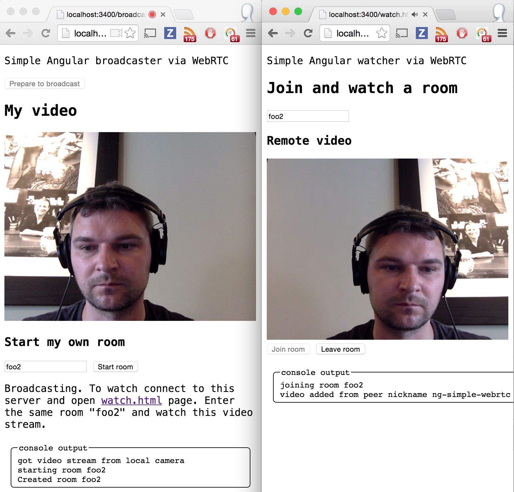

# ng-simple-webrtc

> AngularJS wrapper for SimpleWebRTC client from https://simplewebrtc.com/

[![NPM][npm-icon] ][npm-url]
[![Circle CI][circle-ci-icon] ][circle-ci-url]

AngularJS client for starting video / broadcasting to multiple peers via WebRTC, built
on top of the [SimpleWebRTC](https://simplewebrtc.com/) code.

This example wraps the calls to the WebRTC library into 2 simple Angular directives: a broadcaster
and a room watcher. A single broadcasted stream can be viewed by multiple watchers in a single room.

## Demo

To run the demo locally, clone the repo or install from NPM, then

    npm start

Open the broadcast page `localhost:3400/broadcast.html` and create a room. Open `localhost:3400/watch.html`
in a separate browser tab and enter the same room name. You should see the broadcasted picture.



## Install

    npm install ng-simple-webrtc --save

Include the script tags, at least Angular and SimpleWebRTC before this module

```html
<script src="node_modules/angular/angular.js"></script>
<script src="node_modules/simplewebrtc/latest.js"></script>
<script src="node_modules/ng-simple-webrtc/ng-simple-webrtc.js"></script>
```

Add `SimpleWebRTC` to the list of your application's module dependencies

```js
angular.module('WatchApp', ['SimpleWebRTC'])
    // adds custom directive <watch-room>
```

## Broadcast a room

Use directive `broadcaster` to connect to the local camera and broadcast the picture.
Communicate the room name, and see the status properties (`hasStream`, `isBroadcasting`) via
isolate scope's properties.

```html
<broadcaster
  has-stream="hasStream"
  room-name="roomName"
  is-broadcasting="isBroadcasting"></broadcaster>
```

To connect to the camera and start a room, broadcast events `prepare` and `start`

```html
<div ng-controller="BroadcastAppController">
  <broadcaster
    has-stream="hasStream"
    room-name="roomName"
    is-broadcasting="isBroadcasting"></broadcaster>

  <button ng-click="prepare()" ng-disabled="hasStream">Prepare to broadcast</button>
  <div ng-show="hasStream">
    <input type="text" ng-model="roomName" placeholder="Enter a new room name" />
    <button ng-click="start()" ng-disabled="!roomName || broadcasting">Start room</button>
  </div>
</div>
```
```js
angular.module('BroadcastApp', ['SimpleWebRTC'])
  .controller('BroadcastAppController', function ($scope) {
    $scope.hasStream = false;
    $scope.roomName = '';
    $scope.isBroadcasting = '';
    $scope.prepare = function prepare() {
      $scope.$broadcast('prepare');
    };
    $scope.start = function start() {
      $scope.$broadcast('start');
    };
  });
```

See file [broadcast.html](broadcast.html) for the full demo

## Watch a room

To join and watch a room (without broadcasting anything yourself) use `watch-room` directive.
You can pass the room name and see the status via isolate scope attributes

```html
<input type="text" ng-model="roomName" placeholder="Join room with name" />
<watch-room room-name="roomName" joined-room="joinedRoom"></watch-room>
```

You can start watching (join a room) and stop watching (leave a room) by broadcasting
an event

```html
<div ng-controller="WatchAppController">
  <input type="text" ng-model="roomName" placeholder="Join room with name" />
  <watch-room room-name="roomName" joined-room="joinedRoom"></watch-room>
  <button ng-click="joinRoom()">Join room</button>
  <button ng-click="leaveRoom()">Leave room</button>
</div>
```

```js
angular.module('WatchApp', ['SimpleWebRTC'])
  .controller('WatchAppController', function ($scope) {
    $scope.roomName = '';
    $scope.joinedRoom = false;
    $scope.joinRoom = function () {
      $scope.$broadcast('joinRoom');
    };
    $scope.leaveRoom = function () {
      $scope.$broadcast('leaveRoom');
    };
  });
```

See the included file [watch.html](watch.html) as an example

### Small print

Author: Gleb Bahmutov &copy; 2015

* [@bahmutov](https://twitter.com/bahmutov)
* [glebbahmutov.com](http://glebbahmutov.com)
* [blog](http://glebbahmutov.com/blog/)

License: MIT - do anything with the code, but don't blame me if it does not work.

Spread the word: tweet, star on github, etc.

Support: if you find any problems with this module, email / tweet /
[open issue](https://github.com/bahmutov/ng-simple-webrtc/issues) on Github

## MIT License

Copyright (c) 2015 Gleb Bahmutov

Permission is hereby granted, free of charge, to any person
obtaining a copy of this software and associated documentation
files (the "Software"), to deal in the Software without
restriction, including without limitation the rights to use,
copy, modify, merge, publish, distribute, sublicense, and/or sell
copies of the Software, and to permit persons to whom the
Software is furnished to do so, subject to the following
conditions:

The above copyright notice and this permission notice shall be
included in all copies or substantial portions of the Software.

THE SOFTWARE IS PROVIDED "AS IS", WITHOUT WARRANTY OF ANY KIND,
EXPRESS OR IMPLIED, INCLUDING BUT NOT LIMITED TO THE WARRANTIES
OF MERCHANTABILITY, FITNESS FOR A PARTICULAR PURPOSE AND
NONINFRINGEMENT. IN NO EVENT SHALL THE AUTHORS OR COPYRIGHT
HOLDERS BE LIABLE FOR ANY CLAIM, DAMAGES OR OTHER LIABILITY,
WHETHER IN AN ACTION OF CONTRACT, TORT OR OTHERWISE, ARISING
FROM, OUT OF OR IN CONNECTION WITH THE SOFTWARE OR THE USE OR
OTHER DEALINGS IN THE SOFTWARE.

[npm-icon]: https://nodei.co/npm/ng-simple-webrtc.png?downloads=true
[npm-url]: https://npmjs.org/package/ng-simple-webrtc
[circle-ci-icon]: https://circleci.com/gh/bahmutov/ng-simple-webrtc.svg?style=svg
[circle-ci-url]: https://circleci.com/gh/bahmutov/ng-simple-webrtc
